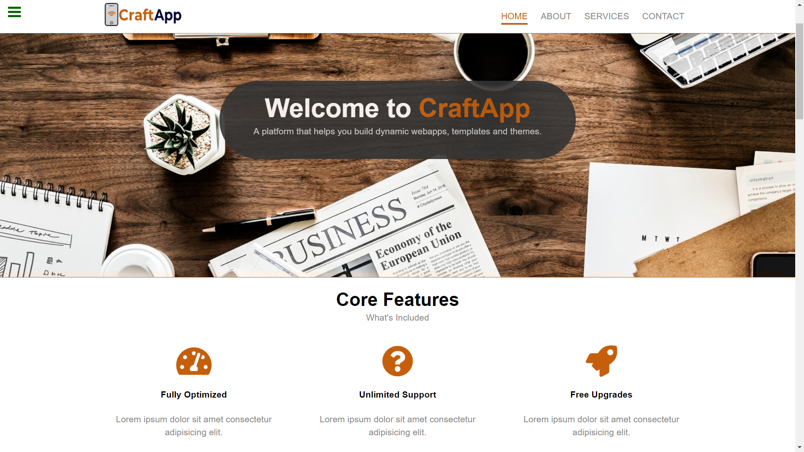

# [Product Landing Page](https://learn.freecodecamp.org/responsive-web-design/responsive-web-design-projects/build-a-product-landing-page/)

A Product Landing Page as a freeCodeCamp's Responsive Web Design Track Project, where I created a fictional product landing page to show what the product can offer in a web page.

## Built with:
- HTML5
- CSS3
- [CodePen](https://codepen.io/genesisgabiola/full/zMYPgX/)

Visit the [live preview](https://genesisgabiola.github.io/freeCodeCamp-projects/product-landing-page/) here.

## Future Improvements:
- [ ] Organize Images and make it more responsive.
- [ ] Add some styling and animation.
- [ ] Add a background picture in the video and fix the overlay background image.

## How to Contribute?
Choose what you prefer:
- Open an issue [here](https://github.com/genesisgabiola/freeCodeCamp-projects/issues).
- Contact me on [twitter](http://twitter.com/genesisgabiola).
- If you want email, its [here](mailto:genesisbritanicogabiola@gmail.com).

Any queries, suggestions, issues to report or critics are welcome :) You can freely connect to me.