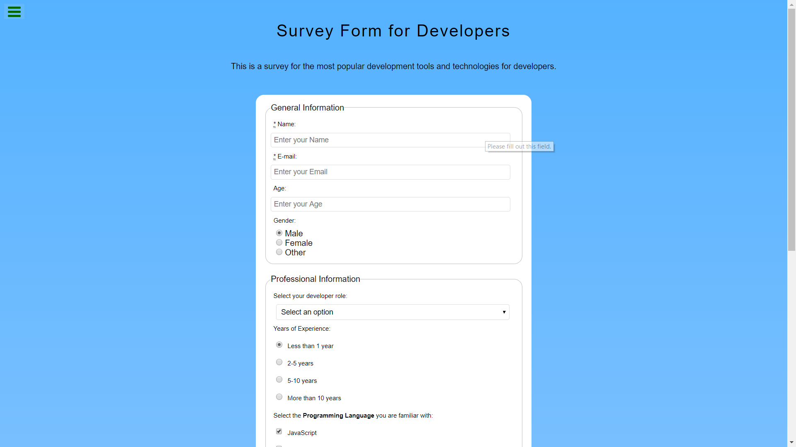

# [Tribute Page](https://learn.freecodecamp.org/responsive-web-design/responsive-web-design-projects/build-a-tribute-page)

A Survey Form page as a freeCodeCamp's Responsive Web Design Track Project, where I show most of the elements needed to make a form.

## Built with:
- HTML5
- CSS3
- [CodePen](https://codepen.io/genesisgabiola/full/EOYzPm/)

Visit the [live preview](https://genesisgabiola.github.io/freeCodeCamp-projects/survey-form/) here.

## Future Improvements:
- [ ] Organize all the elements in form.
- [ ] Make it fully reponsive.
- [ ] Add some styling and animation.

## How to Contribute?
Choose what you prefer:
- Open an issue [here](https://github.com/genesisgabiola/freeCodeCamp-projects/issues).
- Contact me on [twitter](http://twitter.com/genesisgabiola).
- If you want email, its [here](mailto:genesisbritanicogabiola@gmail.com).

Any queries, suggestions, issues to report or critics are welcome :) You can freely connect to me.