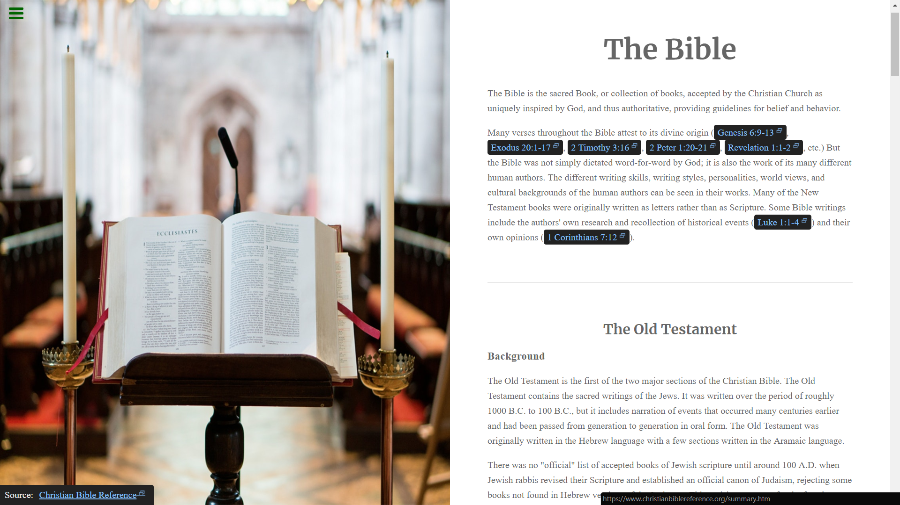

# [Tribute Page](https://learn.freecodecamp.org/responsive-web-design/responsive-web-design-projects/build-a-tribute-page)

The Bible tribute page as a freeCodeCamp's Responsive Web Design Track Project, where I show some information about the bible.

## Description:
**Objective:** Build a CodePen.io app that is functionally similar to this: https://codepen.io/freeCodeCamp/full/zNqgVx.

## Challenge Requirements:
Fulfill the below [user stories](https://en.wikipedia.org/wiki/User_story) and get all of the tests to pass. Give it your own personal style.
- User Story: Container that contains all the other elements.
- User Story: I can see a `title` that describes the subject, responsive `image` with `caption` that contains textual content describing the image, and `links` that will take me to an external website with further information on the subject.

## Built with:
- HTML5
- CSS3
- [CodePen]()

Visit the [live preview](https://genesisgabiola.github.io/freeCodeCamp-projects/tribute-page) here.

## How to Contribute?
Choose what you prefer:
- Open an issue [here](https://github.com/genesisgabiola/freeCodeCamp-projects/issues).
- Contact me on [twitter](http://twitter.com/genesisgabiola).
- If you want email, its [here](mailto:genesisbritanicogabiola@gmail.com).

Any queries, issues to report, suggestions, or critics are welcome :) You can connect to me.